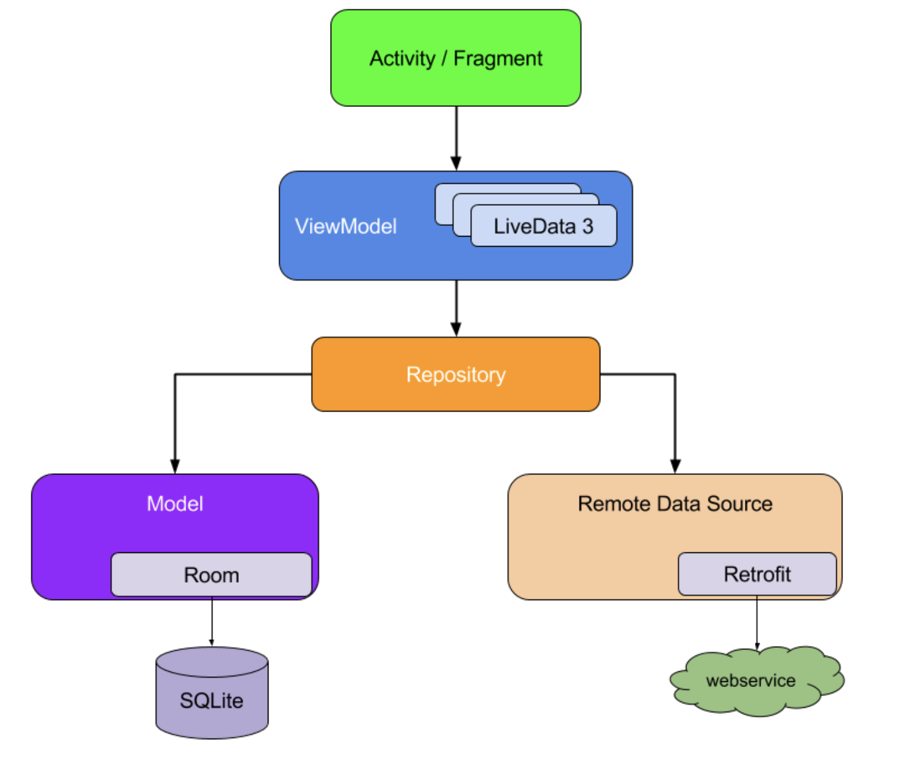

# TMDB API  With Paging3

Here we would be displaying movies data from TMDB APIs along with sorting option based on Popular , Top-Rated , Low-Rated movies
On Clicking of card , a complete info about the movie will be shown 

# Project features 🚀

-   100% [Kotlin](https://kotlinlang.org/)
-   Kotlin Coroutines with Flow
-   Pagination with paging3 library along with header and footer with offline support with RoomDB
-   Clean Architecture with MVVM 
-   Modern architecture (Clean Architecture, Model-View-ViewModel)
-   View Bindng, Material Design
-   Navigation, single-activity architecture with [Jetpack Navigation](https://developer.android.com/guide/navigation)
-   Cache local data with [Room Persistence Library](https://developer.android.com/topic/libraries/architecture/room)
-   ViewModel, LiveData, Lifecycle, ... with [Android Jetpack](https://developer.android.com/jetpack)
-   Dependency injection [Dagger](https://developer.android.com/training/dependency-injection/dagger-basics)

# Get your api key from here  (https://www.themoviedb.org/documentation/api)

# Screenshots

|                         |                         |                         |                         
|        :---:            |          :---:          |        :---:            |      
|  |  

|                         |                                       |
|       :---:             |                      :---:            |
|  |  |

|                         |                                       |
|       :---:             |                      :---:            |
|  |  |
